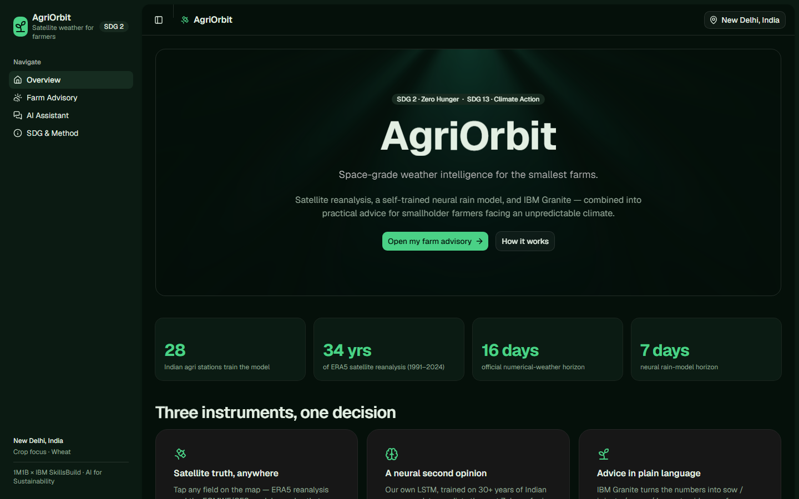
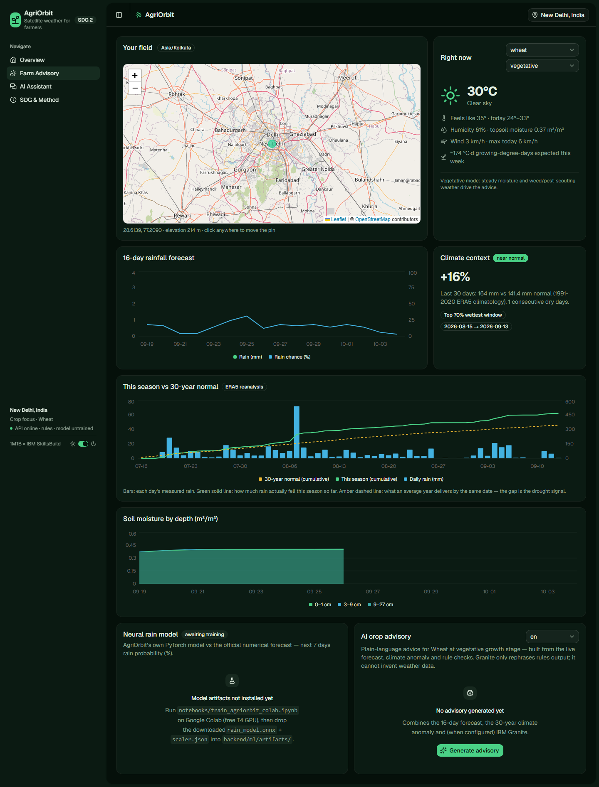

# 🛰️🌾 AgriOrbit

**AI satellite-weather advisory for smallholder farmers** — built for the 1M1B – IBM SkillsBuild
*“AI + Sustainability”* Virtual Internship (July–Sep 2026).

AgriOrbit turns space data into farm decisions: tap any field on the map and get a hyperlocal
16-day forecast, a 30-year climate baseline comparison, an in-house neural rain model, and a
plain-language advisory from IBM Granite telling the farmer when to sow, irrigate, spray and
harvest — in language a person, not a meteorologist, understands.



## Problem statement

> **How might we use AI to give smallholder farmers satellite-grade weather and rainfall
> guidance, so that farming becomes more climate-resilient and sustainable?**

- **Who is affected:** ~120 million Indian smallholder farm households (~500 million globally)
  whose sowing, irrigation and harvest timing decides a season's income, while rain arrives
  ever more erratically.
- **Why AI:** raw weather grids don't make decisions. Prediction (LSTM on reanalysis),
  anomaly analysis vs 30-year normals, and an LLM translating everything into plain language
  turn data into action at near-zero marginal cost.

## SDG alignment

| SDG | Role | Targets |
| --- | --- | --- |
| **SDG 2 — Zero Hunger** | **Primary** | **2.3** smallholder productivity & incomes · **2.4** resilient, climate-adaptive agriculture |
| **SDG 13 — Climate Action** | Secondary | **13.1** resilience to climate hazards (drought, extreme rain, heat) |

## What the app does

| Feature | Stack | Page |
| --- | --- | --- |
| Field picker (search, GPS, recent fields, click the map) | Open-Meteo geocoding + react-leaflet | Advisory |
| 16-day hyperlocal forecast + soil moisture ×4 depths | Open-Meteo (ECMWF IFS / GFS) | Advisory |
| 30-year ERA5 climate anomaly + “season vs normal” cumulative chart | Open-Meteo archive | Advisory |
| **Growth-stage-aware advice** (planning → harvest re-prioritises actions) | Rules engine stage modelling | Advisory |
| **Neural rain model** (next-7-day rain probabilities + expected mm) | PyTorch LSTM → ONNX, trained on ERA5 1991–2024 @ 28 Indian stations | Advisory |
| **AI crop advisory** in plain language, **English / हिंदी** | IBM Granite (NVIDIA API) grounded in a deterministic rules engine | Advisory |
| **Download advisory as Markdown** (share on WhatsApp) | client-side export | Advisory |
| Growing-degree-days (GDD) outlook chip | derived client-side | Advisory |
| **Chat assistant** with agronomy knowledge base (RAG) + quick prompts | IBM Granite + keyword RAG | Chat |
| Sidebar live system status (API / Granite / model) + theme toggle | `/api/health` polling | everywhere |
| SDG mapping, model card, Responsible AI section | — | About |

No API key is needed for weather data. **Without `NVIDIA_API_KEY`, advisory + chat run on the
rules-engine fallback** — the demo always works.

## Architecture

```
┌─ frontend (bun · Vite · React 19 · Tailwind v4) ────────────────────────────┐
│  shadcn registry components only · ReactBits animations · recharts · leaflet │
└────────────── /api (vite proxy) ────────────────────────────────────────────┘
┌─ backend (uv · Python 3.13 · FastAPI) ──────────────────────────────────────┐
│  services/openmeteo.py — forecast/archive/geocode client (+TTL cache)        │
│  services/climate.py   — ERA5 1991-2020 climatology anomaly                  │
│  services/rules.py     — agronomy rules engine (alerts, base advisory)       │
│  services/ml_forecast.py — ONNX runtime inference (no PyTorch locally)       │
│  services/granite.py   — IBM Granite via NVIDIA OpenAI-compatible API        │
│  services/kb.py        — keyword RAG over app/kb/*.md                        │
└──────────────────────────────────────────────────────────────────────────────┘
┌─ notebooks/train_agriorbit_colab.ipynb (Google Colab · free T4 GPU) ─────────┐
│  downloads ERA5 (28 stations × 1991-2024) → trains LSTM → evaluates vs       │
│  climatology baseline → exports rain_model.onnx + scaler.json + metrics.json │
└──────────────────────────────────────────────────────────────────────────────┘
```

## Getting started

```powershell
# 1 · backend (terminal 1)
cd backend
uv run uvicorn app.main:app --reload --port 8000     # → http://localhost:8000/api/health

# 2 · frontend (terminal 2)
cd frontend
bun install
bun run dev                                          # → http://localhost:5173
```

The app is fully usable now (rules-engine advisory, all charts, climate anomaly, map, chat
fallback). To unlock everything:

### A · Enable IBM Granite (optional, 2 minutes)

1. Get a free key at <https://build.nvidia.com> (search “Granite”).
2. `cd backend; copy .env.example .env` and paste it as `NVIDIA_API_KEY=...`
3. Restart the backend — the advisory badges switch from *Rules engine* to *IBM Granite*.

### B · Train the neural rain model (optional, ~20 min on a free Colab T4)

1. Open <https://colab.research.google.com> → *Upload* → `notebooks/train_agriorbit_colab.ipynb`
2. `Runtime → Change runtime type → T4 GPU`, then `Runtime → Run all`
3. Unzip the downloaded `agriorbit_artifacts.zip`, copy
   `rain_model.onnx · scaler.json · metrics.json` into `backend/ml/artifacts/`
4. Restart the backend → `/api/modelinfo` reports the real validation metrics
   and the dashboard shows the neural-vs-official comparison chart.

## Verification

| Check | Command |
| --- | --- |
| Backend unit + API tests (offline) | `cd backend; uv run pytest` |
| Frontend type-check + build | `cd frontend; bun run build` |
| Visual smoke test (both dev servers running) | `uv run --with playwright python scripts/capture_screenshots.py` |



## Responsible AI (summary)

- **Fairness** — predictions use physical weather features only; training stations span every
  Indian agro-climatic zone.
- **Transparency** — every advisory shows its source (Granite vs rules), the numbers behind it,
  and the model's published validation accuracy next to a climatology baseline.
- **Ethics** — advisory is assistive, never directive; chemical-dosage questions redirect to
  agronomists; the neural model is labelled a *second opinion*, not a replacement for IMD.
- **Privacy** — no accounts, no server-side storage; the only location used lives in the
  farmer's own browser.

Full text: in-app **About** page. Internship deliverable slides can lift the problem statement,
SDG mapping, screenshots (`docs/screenshots/`) and this section directly.

## Team / credits

Built by **Malay Chhatbar** for the 1M1B × IBM SkillsBuild AI for Sustainability Internship.
Data: Open-Meteo (ECMWF IFS / NOAA GFS), ERA5/ERA5-Land (Copernicus), OpenStreetMap.
Models: IBM Granite 3.3 (NVIDIA API) · custom PyTorch LSTM. UI: shadcn registry + ReactBits.
